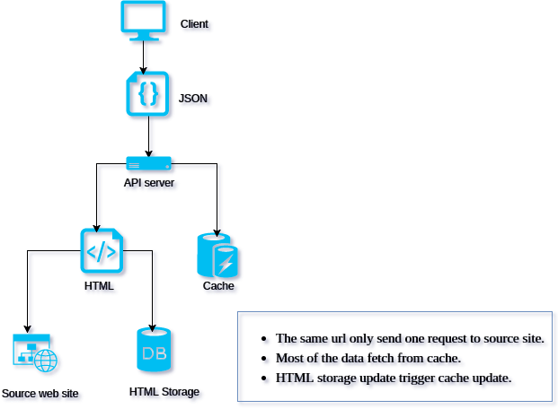

## Toapi

Make Every website provides APIs.


## Introduction

Topapi is a supper slight server framework, which provide one way to ask for every website to provide apis.

We don't need to climb the website day by day. Because they should provide the API we need!

All we need is a Temme snippet.

## Architecture

Toapi provide multi cache for every page u visit. So, don't worry about u make a huge trivial ddos like to the website.



## Get Started

### Install

```bash
git clone git@github.com:yesvods/toapi.git
cd toapi && npm install
```

### Start Example

* Node Require: 8.6+ to support async function

```bash
npm start
# then visit localhost:3000/job/3616345
```

That's all, can't be simple much more. Read more about [example](example).

## NPM

Install the NPM module:

```
npm install toapi
```

### Usage

Let's say we need to visit the job detail `API` of `lagou`.

Such as `https://www.lagou.com/jobs/3616345.html`

We just write a [temme](https://github.com/shinima/temme) selector like:

```
...
.job_company@company {
  .fl{find($name|fp, '拉勾认证企业')}
  .c_feature li:nth-child(1){find($domain|fp, '领域')}
  .c_feature li:nth-child(2){find($stage|fp, '发展阶段')}
  .c_feature li:nth-child(3){find($size|fp, '规模')}
  .c_feature li:nth-child(4) a[href=$link];
}
...
```

If u don't know what `temme` is. Maybe u can ref this: https://github.com/shinima/temme

And then `register` it!

```js
const ToAPI = require('toapi')

ToAPI.register({
  routeName: '/job/:id',
  matchUrl: 'https://www.lagou.com/jobs/:id.html',
  selector: selector,
})

ToAPI.start(3000)
```

All things are done, enjoy ur website swimming.

### API

#### ToAPI.start(port, options)

Start the `ToAPI` server, u can continue to `register` route after server started.

* port
  * the starting port
* options
  * watiUntil, defaults to `domcontentloaded`
    * Spec the browser event that represent page data is ready.
    * more options can be see [here](https://github.com/GoogleChrome/puppeteer/blob/master/docs/api.md#pagegotourl-options)
  * timeout, defaults to `30000`
    * Spec timeout value when requesting to the target page.

```js
// pageA will be timeout after 30000(default) ms
ToAPI.register(pageA)

ToAPI.start(3000, { timeout: 60000 })

// pageB will be timeout after 60000 ms
ToAPI.register(pageB)
```

#### ToAPI.register(options)

Register the page route to be served.

* routeName (optional)
  * The same as koa route
  * `ToAPI` will parse from `matchUrl` if not specified.
  * eample: `/page/:id`
* matchUrl
  * The target website match route
  * example: `http://example.com/page/:id`
* selector (optional)
  * The [Temme](https://github.com/shinima/temme) Selector to spec page
* waitUntil
  * DefaultsTo: `domcontentloaded`
* timeout
  * DefaultsTo: `30000`
